```


██████╗  █████╗  ██████╗██╗  ██╗██╗   ██╗██████╗     ███████╗ ██████╗██████╗ ██╗██████╗ ████████╗
██╔══██╗██╔══██╗██╔════╝██║ ██╔╝██║   ██║██╔══██╗    ██╔════╝██╔════╝██╔══██╗██║██╔══██╗╚══██╔══╝
██████╔╝███████║██║     █████╔╝ ██║   ██║██████╔╝    ███████╗██║     ██████╔╝██║██████╔╝   ██║	
██╔══██╗██╔══██║██║     ██╔═██╗ ██║   ██║██╔═══╝     ╚════██║██║     ██╔══██╗██║██╔═══╝    ██║	
██████╔╝██║  ██║╚██████╗██║  ██╗╚██████╔╝██║         ███████║╚██████╗██║  ██║██║██║        ██║ 
╚═════╝ ╚═╝  ╚═╝ ╚═════╝╚═╝  ╚═╝ ╚═════╝ ╚═╝         ╚══════╝ ╚═════╝╚═╝  ╚═╝╚═╝╚═╝        ╚═╝	


```


# Backup-Script

> **Note** : 
> This is an automated backup script that takes a backup of the Filesystem and Database and uploads the backups to the FTP-Server and retains the backup data for a specified time.

> **Warning** : 
> This script works in LINUX BASED server's only

## Requirements 
---
> **Note**
> This script should be executed as SUDO user or SUDO privileged user.

-   This script requires **Python3**, **Cron**, **Tarball**, **FTP** to be installed in the server.

## Usage
---
1. Clone this repository to your server from where you want to take backups.
```
https://github.com/ladybirdweb/backup-script.git
```

2. Once the repository is cloned go inside the directory and you can find two files **main.py** and **cron.sh** after that follow the below steps.

3. In this script we need to provide the below details to do the backup and upload operations.

4. First we need to set the variable to the script in the **main.py** file, below are the details that we have to update in the script.
```
# Set the Backup Retention period in days for REMOTE Default 7 days:
BACKUP_RETENTION = 7

# Set the Backup Retention period in days for local data, (defined Default as 5 mins):
LOCAL_BACKUP_RETENTION = 5 / (24 * 60)

# Set the directory you want to store backup files
BACKUP_DIRECTORY = "/path/to/backup/directory"

# Set the directory you want to take backup
BACKUP_SOURCE = "/path/to/directory/to/backup"

# Set the MySQL server credentials
# Set the MySQL server credentials
MYSQL_HOST = "localhost" # Default is localhost if you want to use remote host change the value.
MYSQL_PORT = "3306" # Default is 3306 if you want to use a different port change the value accordingly.
MYSQL_USER = "database-username"
MYSQL_PASSWORD = "database-password"

# Set the database name you want to backup
DATABASE_NAME = "database-name"

# Set FTP credentials
FTP_HOST = "ftp-hostname"
FTP_PORT = "21" # Default port is 21 if you have a different value change it accordingly.
FTP_USER = "ftp-username"
FTP_PASS = "ftp-password"

# Set remote directory path to upload in FTP
REMOTE_DIR = "/remote/directory/in/ftp/server"
```

-  **BACKUP_RETENTION =** Here mention the backup retention period that you want to use in the remote FTP-Server in days (default is 7 days), this is used to save the last N no of days in the remote server.
- **LOCAL_BACKUP_RETENTION =** Here mention the backup retention period that you want to use in the local server in days (default is 5 mins). this is used to delete the N no of days old files in the local server.
- **BACKUP_DIRECTORY =** Here mention the directory where you want to store the backup zip files in the local server. (this should be an absolute path)
- **BACKUP_SOURCE=** Here mention the directory in which you want to take a backup i.e filesystem directory. (this should be an absolute path)
- **MYSQL_HOST =** Default is localhost if you want to use a remote host change the value.
- **MYSQL_PORT =** Default is 3306 if you want to use a different port change the value accordingly.
- **MYSQL_USER =** Here mention the MySQL user name. (this user should have full privileges on the DB which you want to take a backup)
- **MYSQL_PASSWORD =** Here mention the MySQL user password. 
- **DATABASE_NAME =** Here mention the Database name which we want to take backup.
- **FTP_HOST =** Here mention the FTP-Server hostname or IP.
- **FTP_PORT =** Default port is 21 if you have a different value change it accordingly.
- **FTP_USER =** Here mention the FTP user name.
- **FTP_PASS =** Here mention the FTP user password.
- **REMOTE_DIR =** Here mention the remote directory on FTP server where you want to upload the backup files.

5. Once the above details are added to the **main.py** file the python script is ready.

6. We need to execute the **cron.sh** this is a shell script you need to change the file permission and execute it to do the same you should be inside the cloned repository.
- To change the file permission run the below command.
```
chmod +x *
```
- To execute the script run the below command.
```
/bin/bash cron.sh
```

7. Once the script is executed it will ask you for the below details.

- You can **ADD** or **REMOVE** cron with the first option, it will ask you whether to add or remove the cronjob like below: you need to enter add or remove as per your need (if you enter to remove the script will search and remove the backup script cronjob)

```
Do you want to add or remove the cron job? Enter 'add' or 'remove':
```
- Then it will ask a confirmation on whether the required details are added to **main.py** file: you can respond with yes or no, if you have added the details enter yes or enter no it will stop the script.
```
Have you added the required details to the main.py script? Enter 'yes' or 'no':
```

- Then it will ask for the absolute path to the cloned directory, to get this detail you can run pwd in your terminal and paste the output here.
```
Enter the directory path for the scripts (to get this directory use 'pwd' command):
```
- Then it will ask for the cron interval there will be three options Daily, Weekly, Monthly 
```
Select the cron interval:
1. Daily (this cron will run daily)
2. Weekly (this cron is defaulted to run every Sunday on every week to change you need to edit interval_choice inside the cron.sh file)
3. Monthly (this cron is defaulted to run on the first of every month to change this you need to edit the interval choice inside the cron.sh file)
```
- The final step is to mention the time in 24.00 hrs format, on this time the cron will run at the specified interval.

```
Enter the time of day to run the cron job (in 24-hour format, e.g. 23:30) or press Enter to use the default time of midnight:
```

8. Once the above is done the cronjob will be created and the script will prompt you with a success message.

## Conclusion

Now the cron will run the script at the specified time and interval which will execute the main.py script to take backup and push to FTP-server.


---


```


██████╗  █████╗  ██████╗██╗  ██╗██╗   ██╗██████╗     ████████╗ ██████╗  ██████╗ ██╗     
██╔══██╗██╔══██╗██╔════╝██║ ██╔╝██║   ██║██╔══██╗    ╚══██╔══╝██╔═══██╗██╔═══██╗██║     
██████╔╝███████║██║     █████╔╝ ██║   ██║██████╔╝       ██║   ██║   ██║██║   ██║██║     
██╔══██╗██╔══██║██║     ██╔═██╗ ██║   ██║██╔═══╝        ██║   ██║   ██║██║   ██║██║     
██████╔╝██║  ██║╚██████╗██║  ██╗╚██████╔╝██║            ██║   ╚██████╔╝╚██████╔╝███████╗
╚═════╝ ╚═╝  ╚═╝ ╚═════╝╚═╝  ╚═╝ ╚═════╝ ╚═╝            ╚═╝    ╚═════╝  ╚═════╝ ╚══════╝
                                                                                        


```

# Backup Tool

> **Note**
> We are using **URBACKUP** a Third Party Tool which is used to backup file system and Database to a remote server, This can be used for both Linux Based and Windows server.

## Requirements
---
1. We need a Server to store the backups which are taken. this server can be Windows or Linux based.

## Usage
1. We need to set up the URBACKUP Server first to do the same follow the below steps.

1.a. In the backup server you need to install URBackup server to install follow this : (https://www.urbackup.org/download.html)

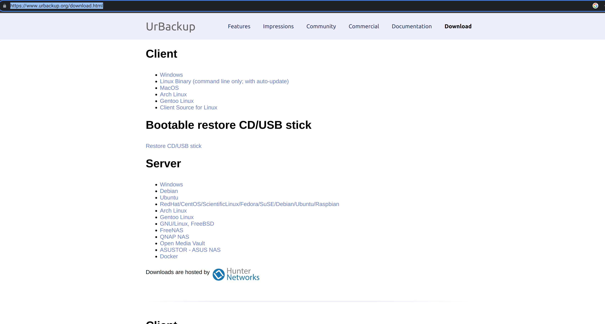

1.b Once the installation is started it might ask for the directory where to store the backups please select a directory and the urbackup user should have permissions to access it once it is done, you can browse the domain or IP of the URBackup server with the port 55414.

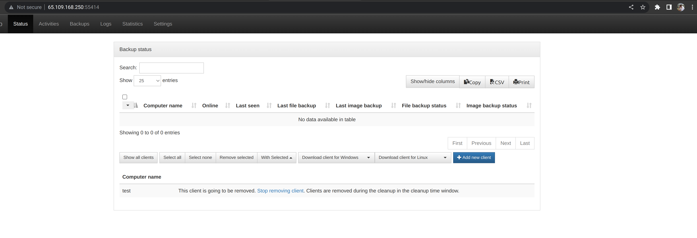

1.c. Once that is done we need to configure the server.

- once the above page is opened we need to create a user and set a password forthe same, to do so we need to click on the setting icon on the top and then click on the user and create a user as shown in the below snap.

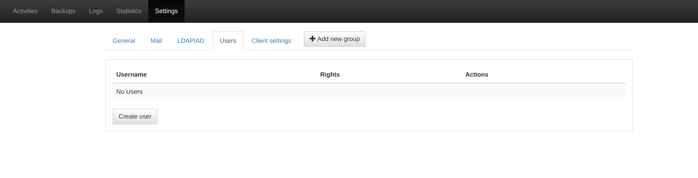

- once the above is done we can continue setting up the server to do so click on general as shown in the below snap.

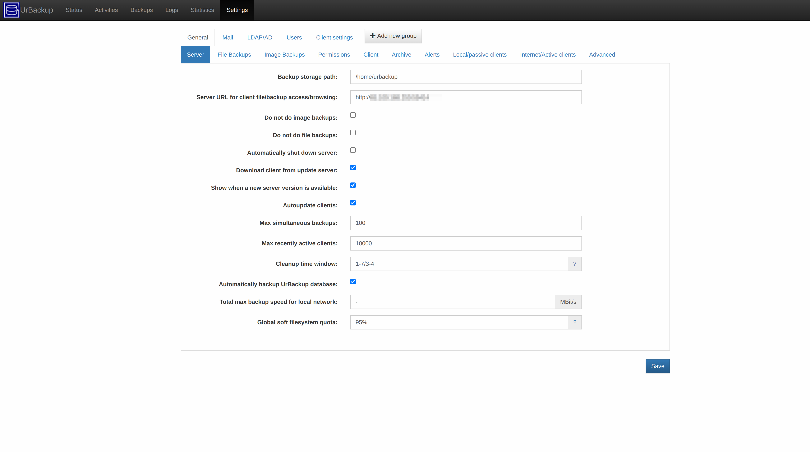

- click on server under general as shown in the above snap and fill the details below as shown in the above.


**Backup storage path**: (this is the location where we need to store the backups in the server).
**Server URL for client file/backup access/browsing**: (here we need to add the server url which you are trying to access urbackup).

- Once that is done we need to set the options for the file backup to do so click the next option after the server as shown in the below snap.

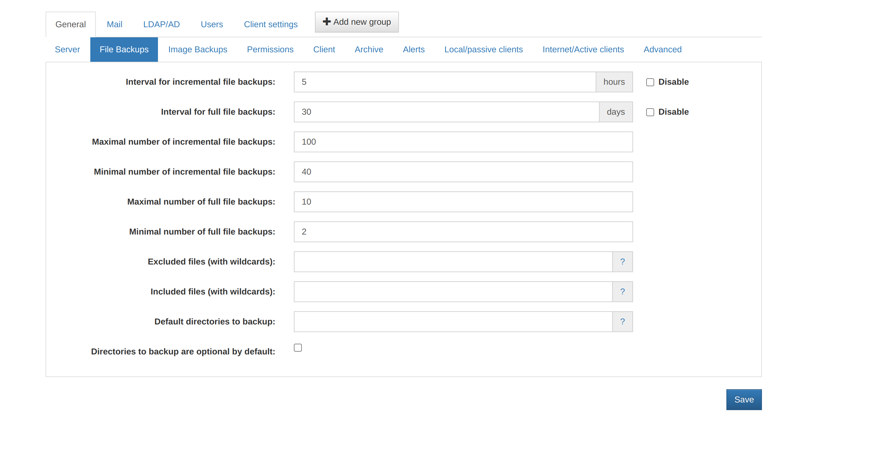

- we need to change the default values like interval for incremental file backups and things as show in the snap above, we can also change the options as per our requirements.


- Then we can also change the options for image backups as shown in the below snap.

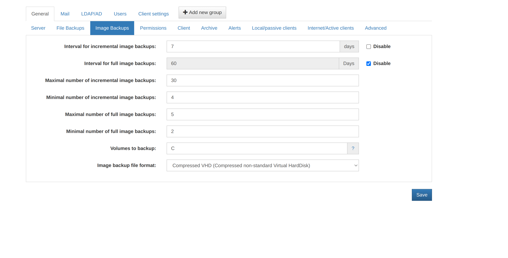

- once the above is done we need to configre the internet/active clients option this will be the confiuration we need to pass in the URbackupp client servers.

- to do the same follow the below snap.

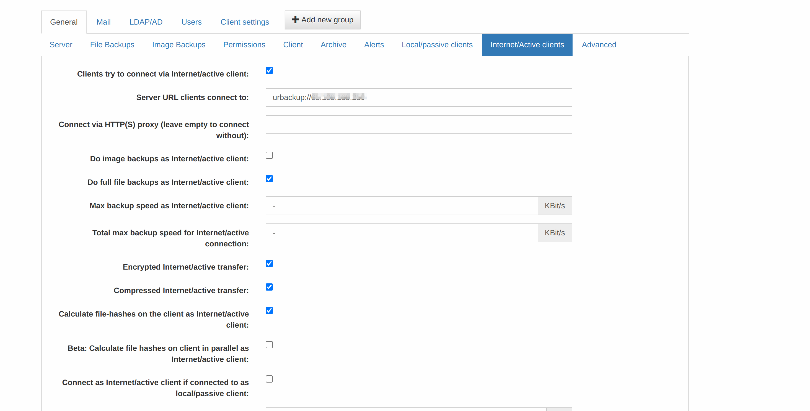

- as shown in the above snap we need to enter the URbackup Server Domain or IP to it, this IP or domain we use for connecting URbackup client to the server.

- once the aboeve is done we can enable email notification for the backup to do so click on mail next to general and configure as show in the below snap.

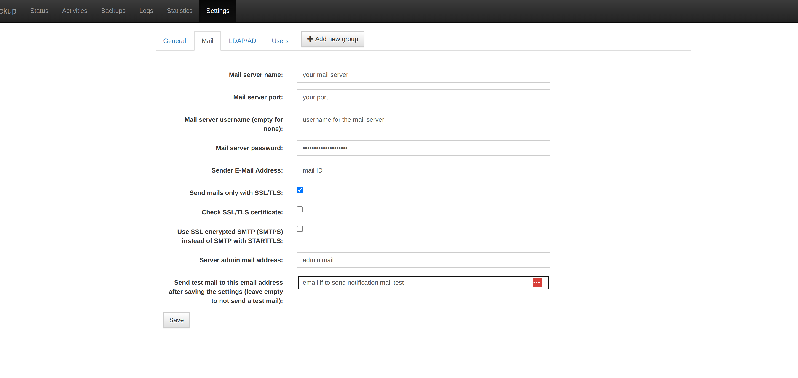

- once this is done the server is ready, now we can start adding clients to the server to do so, follow the below in structions.

- if you go to the urbackup home page, you can find a add client button over there as show in the below snap.


- if we click on the add client it will ask you the client details with the IP or hostname and the client name as show in the below snap.

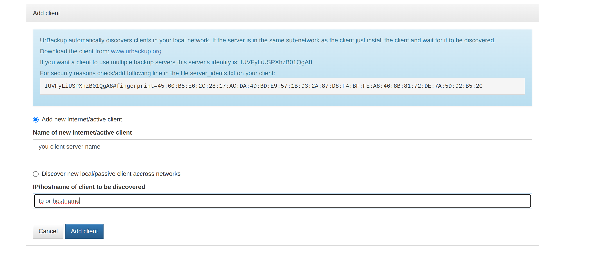

- once this is done it will take you to the client download page as show in the below snap.

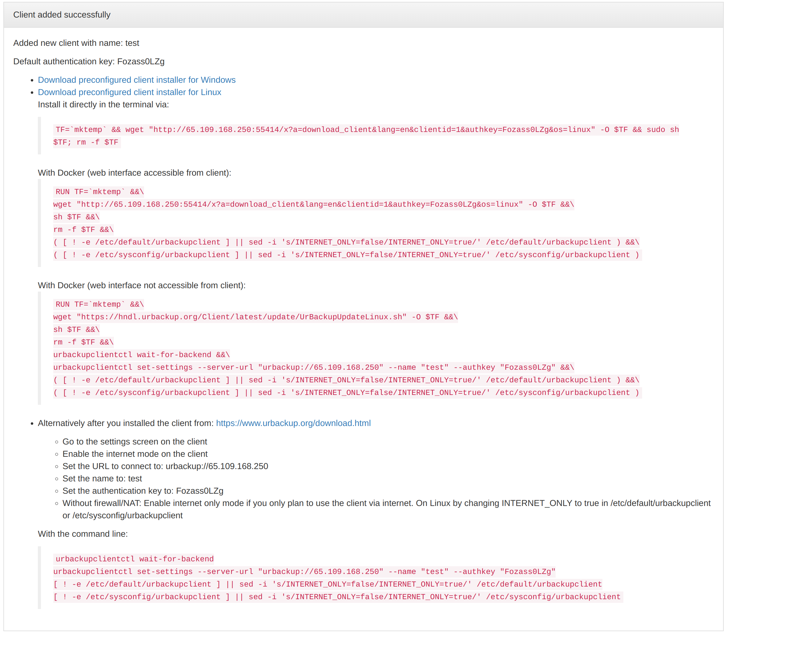

- In the above snap we have options to download clients on different OS like windows, linux, docker..

**For Linux:**

- It is easy for linux we just need to run the command under (Install it directly in the terminal via), this will set up the urbackup client in the linux make sure the port 55414 and passive port range 49152-65534.

- once the above is done we need to setup the directorys which has to be backuped up in client server, the below command is used in terminal to check the current backup directory list:
```
/usr/local/bin/urbackupclientctl list | grep '^Backup directory'
```

- To add a backup direcroty you need to run the below command in the terminal:
```
/usr/local/bin/urbackupclientctl add-backupdir -x -f -d /home/backupdir/
```

- The above command will add the /home/backupdir as the directory whcih has to be backedup.

- To remove a existing direcroty you need to get the direcroty which is added and to be removed from the list command and then need to run the below command replacing your path.
```
/usr/local/bin/urbackupclientctl remove-backupdir --backuppath=/path/to/backup/dir
```

- Once the above is added we need to restart the urbackup client to do so run the below command:
```
systemctl restart urbackupclientbackend
```

- you can find the client in the urbackup dashboard as online and lastseen as shown in the below snap for example.

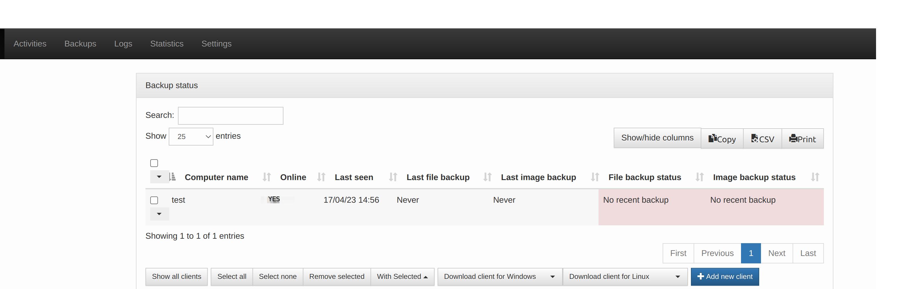

- You can start the backup by clicking the drop down and then you can select whcih type of backup and start it once started it will do the backup as per the intervals setted in the server configuration above.

**For Windows:**

- To setup urbackup client in the windows we need to download the preconfigured windows client from the download page which will be shown while we are adding a client as shown below.


- Once downloaded we need to install the client in the windows machine follow the below snaps.

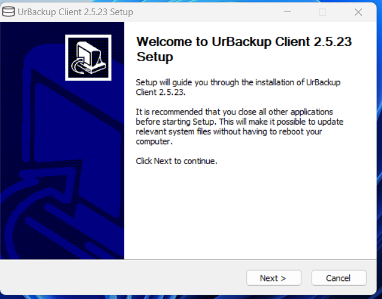
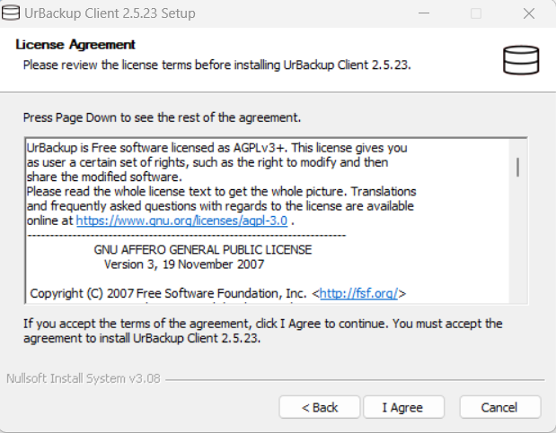
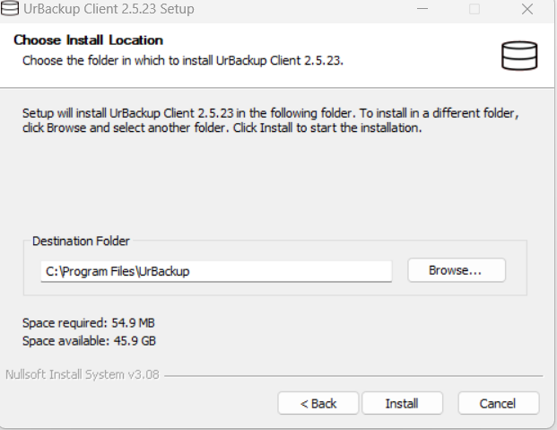

- Once you click on the install the installer will install the urbackup client on the windows machine.

- Once it is installed you will open a configuration page like below.

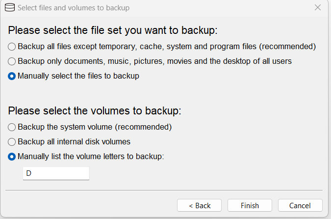

- In the above tab you can selet the mode of backups we can keet the defaults as shown in the above snap and client on finish.

- once that is done the URBackup client is installed with the selected options.

- After that you can find the urbackup icon on the tray as shown in below snap.

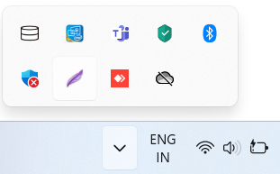

- Right click on the icon will give you the options as shown in below snap.

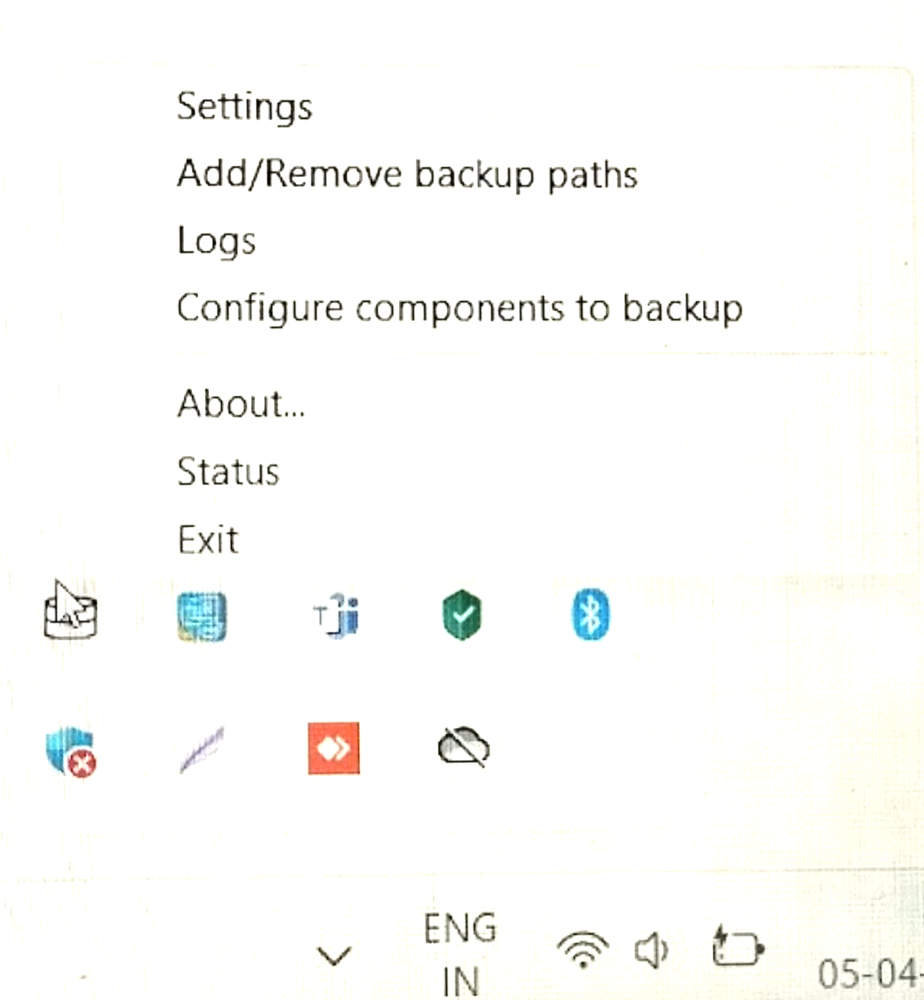

- Click on setting to configure the urbackup client it will open a windows as below.

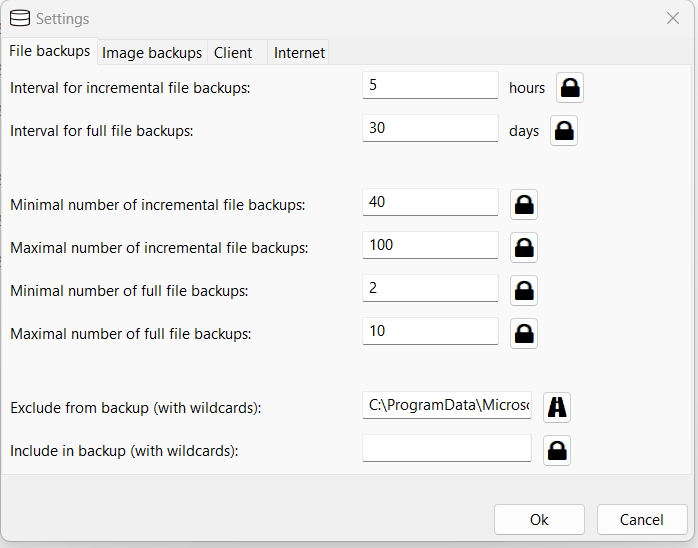

- it will open a tab similar to above image and here you can set the interval of file backups and the folders to exclude and other options you can configre as per your requrement.

- then click on the Imgae backups you will get a tab similar to the below snap and you can configure according to your requirements the default is below.

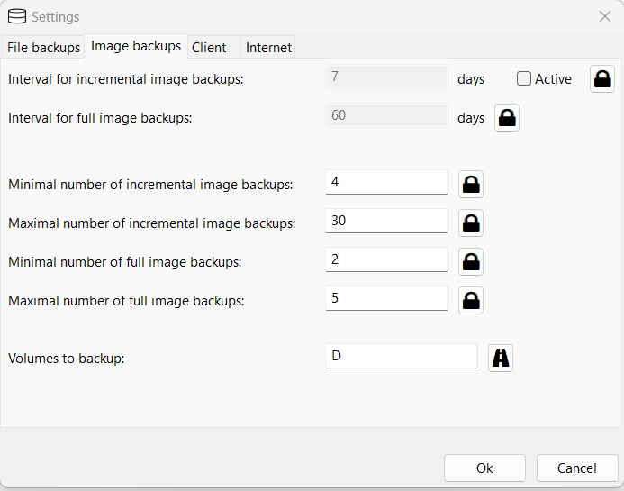

- Once the above is done click on client next to the image backups as this is a preconfigured windows client the client section will be configured alreday so we don't need to chnage anything over there.

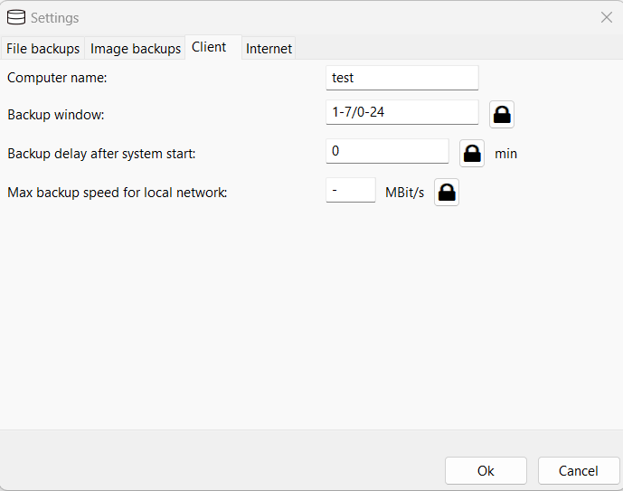

- Once you verify the above, click on the next option Internet, this will also be preconfigured just verify with the server details that we set in the server that tab will be similar to the below.

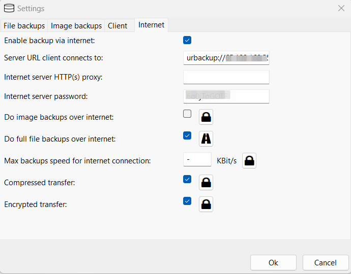

- With the above step the URbackup client configuration on the setting is done. then click on the add/remove backup paths in the tray icon it will open a page similar to the below snap, this we used to set the directory for the backup this is similar to adding directory in the linux. we can also remove the path in the same window.


- Once the above is done the client confiration will be compeletd, restart the urbackup service from the services in your windows machine.

- Once this is done you can check the status of the backup client and backup in the status option on the tray icon. it will be similar to below snap but this snap is a test so the connection is still waiting if it is connected it will show you as connected.

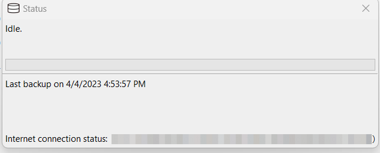

**To take DB backups**

- On Linux with the binary client: Change 0 to 1 in /usr/local/etc/urbackup/mariadbdump.conf. Afterwards file backups will include the dump file of the database at urbackup_backup_scripts/mariadbdump.sql and restart the urbackup client.

- Once the above is done the urbackup will start taking DB backups also.

- Configure the client to backup the MySQL data directory. E.g. /var/lib/mysql on Linux and C:\ProgramData\MySQL\MySQL Server 5.5\data on Windows. Make sure you have configured a snapshotting method on Linux and restart the urbackup client

- This way we will take the entire directory of the mysql.

## To Restore:

- We can download the backups for the URbackup server page, to do so go to the backups page in the urbackup server dashboard as shown in the below snap from there we can download the backups.

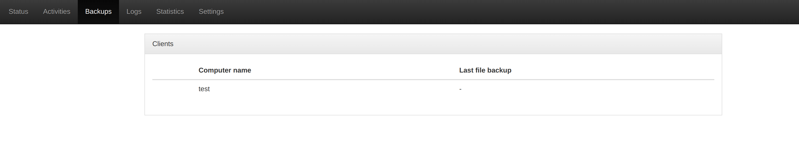

---
## Conclusion:
>**Note**
>The URBackup is configured successfully to take File and DB backups.